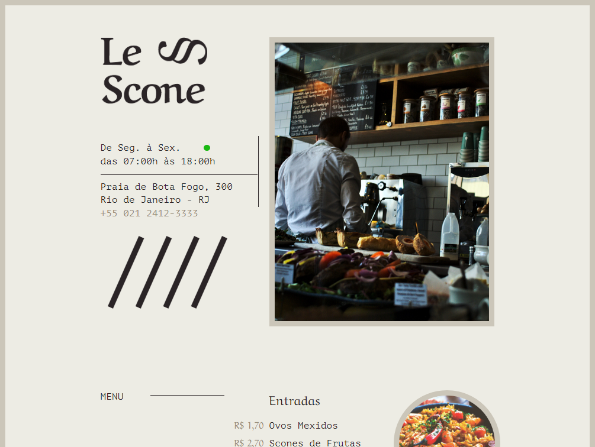

# Pejeto Le Scone
> origamid

>

>Projeto construido no curso de CSS com SASS utilizando grid

>[Clique aqui para acessar!](https://brunosantanadev.github.io/Projeto-le-scone/)

>## Tecnologias?
- HTML

- CSS

- GIT/GITHUB

> # Contato

>  brunosantanadev@gmail.com

> [Linkedin](http://www.linkedin.com/brunosantanadev)

> [Whatsapp](http://wa.me/5521994395138)
